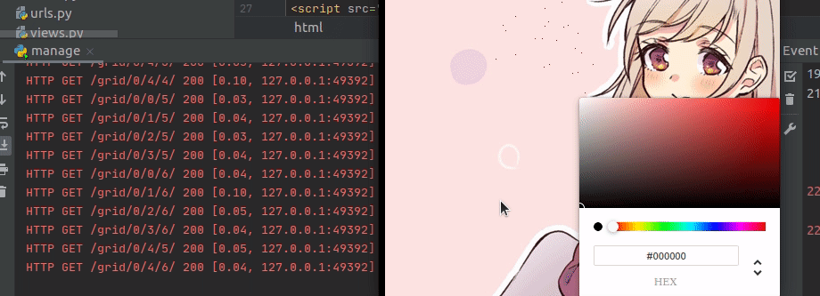
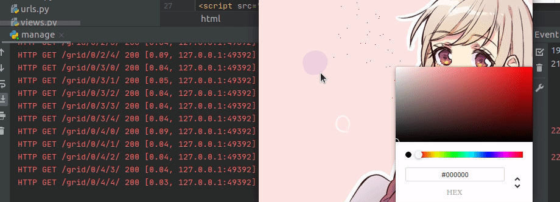
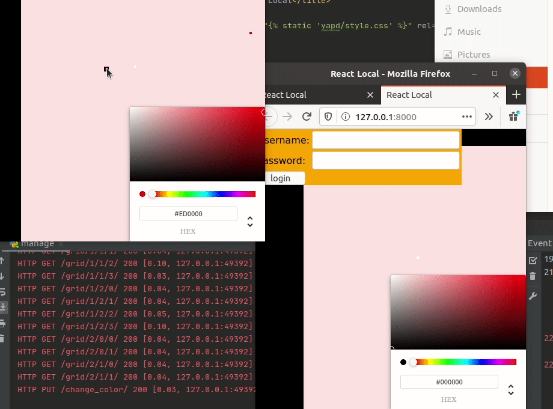

# yet_another_pixel_draw
A simple SPA pixel drawer with RESTful api, react as frontend and django as backend.

### Requirements

* Django
* django rest framework
* channels
* numpy
* pillow
* node.js and npm(to build frontend)
* Redis/docker redis

### Installation

Install as a part of an other [repo](https://github.com/framaz/framaz_sites).

### Running

1. Run redis server on 127.0.0.1:6379(or change settings)
2. Run with manage.py.

You can also try using docker container but you have to change settings.

### API 
Auth methods: session or token (remember that django rest framework by default uses header "Authentication: Token ..." not "...Bearer...")

* PUT /upload_picture/ - a request with binnary picture.
* GET /grid/ - return list of picture pixel grid shape info: [[4, 3], [2, 2] ...] means 0 layer is 4x3 grids, 1 layer is 2x2 grids ...
* GET /grid/size/x/y/ - return array with rgb pixels of size-layer grid at coordinates x, y
* PUT /change_color/ - Body {'x': ..., 'y': ..., 'color': ...} - change picture pixel at coordinates x, y to color 
* GET /history/?date=... - Get history of pixel changes that were created later than date - not really used in now.
* WebSocket /ws/pixel_updater/ - WebSocket connection used for transfering pixel color changing to other users.

### Examples

Data is loaded grid-by grid, only needed grids(that are shown) are visible.

It is possible to resize the field, only grids on seen layer are downloaded.

Sending pixtures via api, which sends new pixel info by websocket to all clients.

### TODO

* Refactor code(docstrings, small coding style and structure fixes).
* API data verification.
* Frontend improvements.